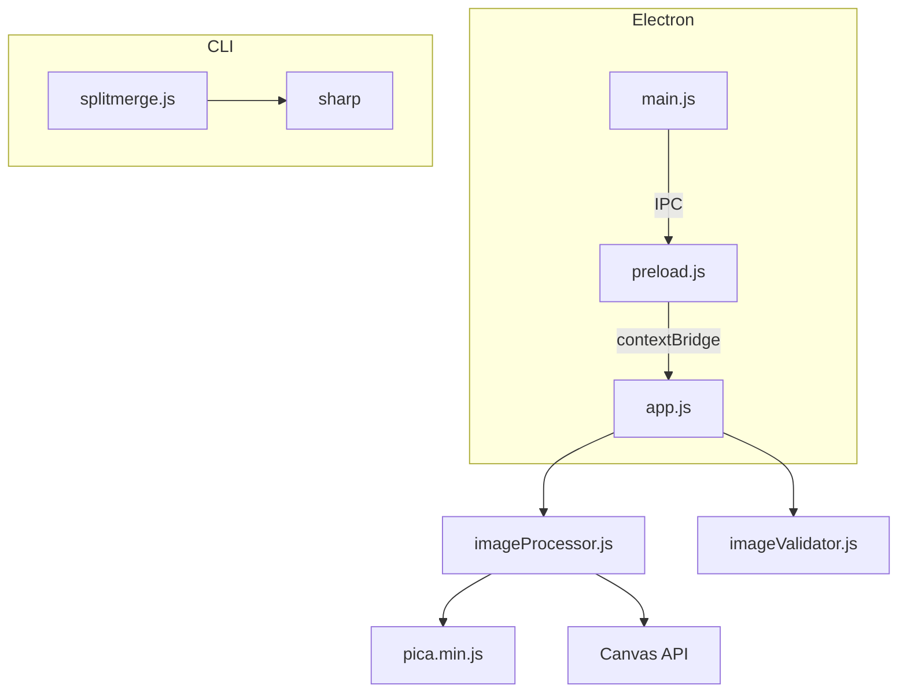

# Art Split Merger

> Desktop app for merging split album cover images into collage layouts.  
> **Repository**: [https://github.com/Angki/image_merger](https://github.com/Angki/image_merger)


## Features

- **Layout Modes**: Split (2), Mixed (3), Grid (4) image layouts
- **Smart Upscaling**: Pica (Lanczos3) for high-quality image resizing
- **Fixed Output**: 3000×3000px for 3 and 4 image layouts
- **Drag & Drop**: Drop images into any slot
- **Clipboard Paste**: Ctrl+V to paste from clipboard
- **Keyboard Shortcuts**: Native shortcuts for saving and copying
- **Reset All**: Quickly clear all slots with one click
- **Real-time Preview**: See merged result before saving
- **Export**: Save as PNG, JPG, or WebP with quality control
- **Copy to Clipboard**: One-click copy merged image
- **Batch Mode**: Process multiple image pairs at once
- **CLI Tool**: Command-line interface with Sharp backend

## Quick Start

```bash
# Install dependencies
npm install

# Run the app
npm start

# Run with DevTools
npm run start:dev
```

## Build

```bash
# Build portable EXE
npm run build:portable

# Build NSIS installer
npm run build:nsis

# Build unpacked directory
npm run build:dir
```

Output files are generated in the `dist/` directory.

## Layouts

| Layout | Description | Output Size |
|--------|-------------|-------------|
| **Split (2)** | Two images side-by-side | Auto / Custom |
| **Mixed (3)** | 2 top + 1 bottom | 3000×3000px |
| **Grid (4)** | 2×2 grid | 3000×3000px |

## Keyboard Shortcuts

| Shortcut | Action |
|----------|--------|
| `Ctrl + S` | Save as PNG |
| `Ctrl + Shift + S` | Save as JPG |
| `Ctrl + Shift + C` | Copy to Clipboard |
| `Ctrl + V` | Paste Image to Slot |

## CLI Usage

```bash
# Install CLI dependencies
cd cli && npm install

# Basic merge
node cli/splitmerge.js --left cover_a.png --right cover_b.png --out merged.png

# Custom dimensions
node cli/splitmerge.js --left a.jpg --right b.jpg --width 3000 --height 1500 --out output.png

# Batch mode
node cli/splitmerge.js --batch pairs.json --out-dir ./merged/
```

## Architecture



## Tech Stack

- **Runtime**: Electron 33
- **Frontend**: Vanilla HTML/CSS/JS (ES Modules)
- **Image Processing**: Canvas API + Pica (Lanczos3)
- **CLI Backend**: Sharp (libvips)
- **Build**: electron-builder
- **Style**: Custom dark theme with CSS Grid

## Development

```bash
# Run tests
npm test

# Lint
npm run lint
```

## License

MIT — see [LICENSE](LICENSE)
